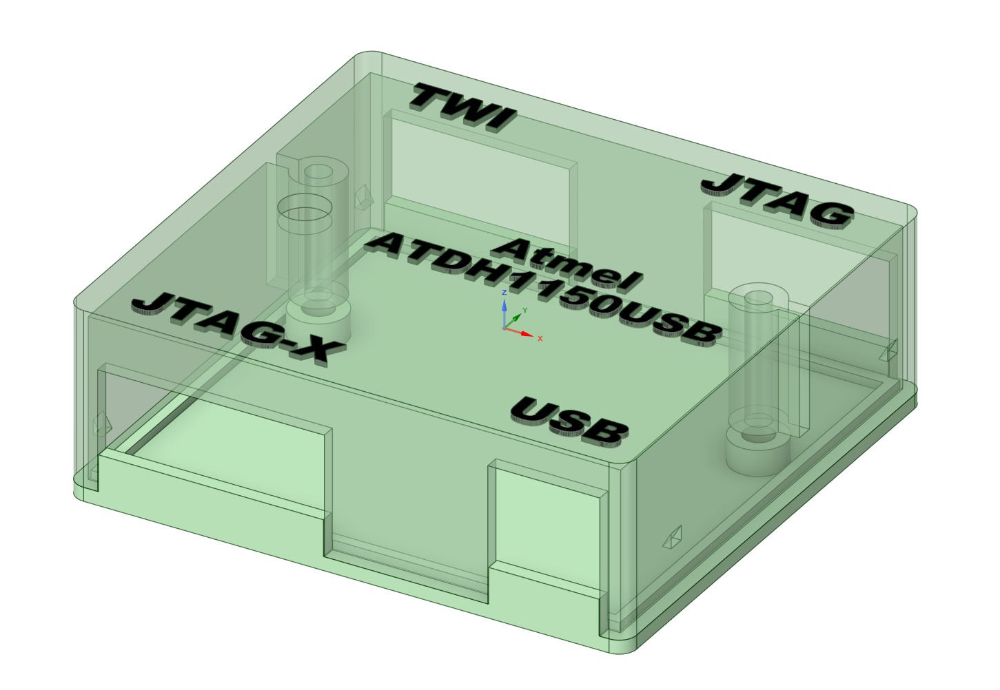
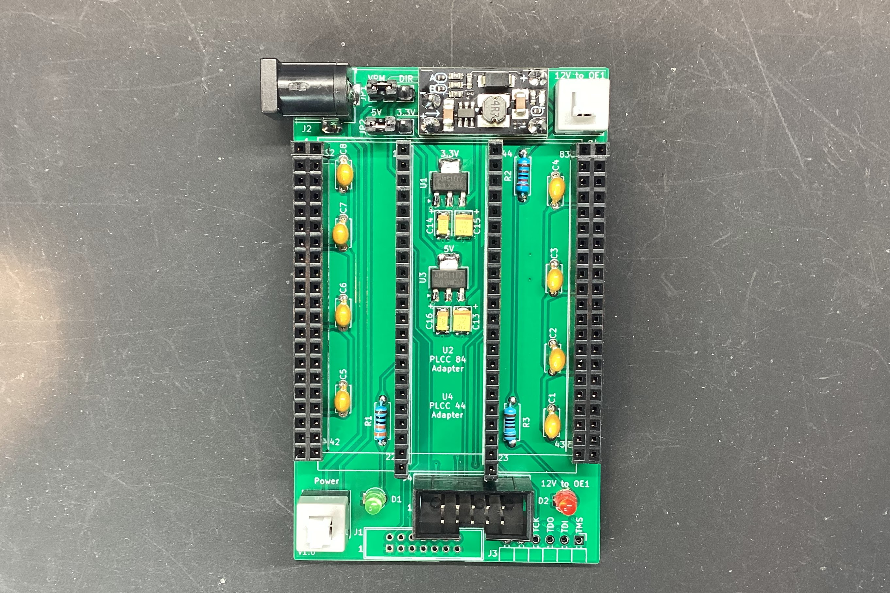
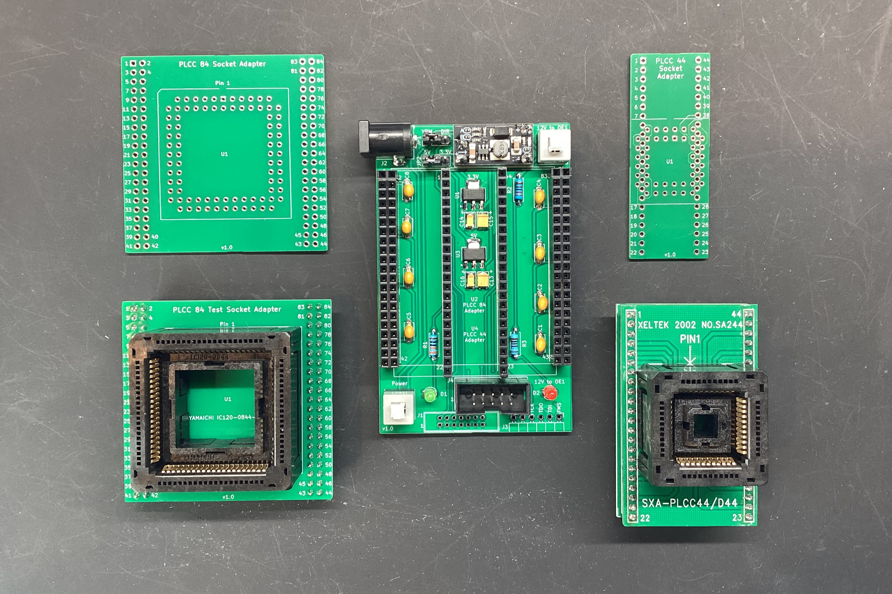
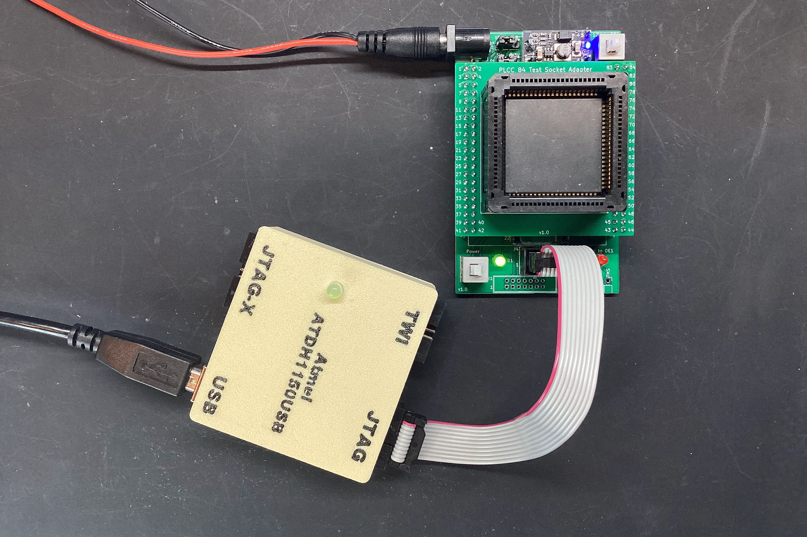
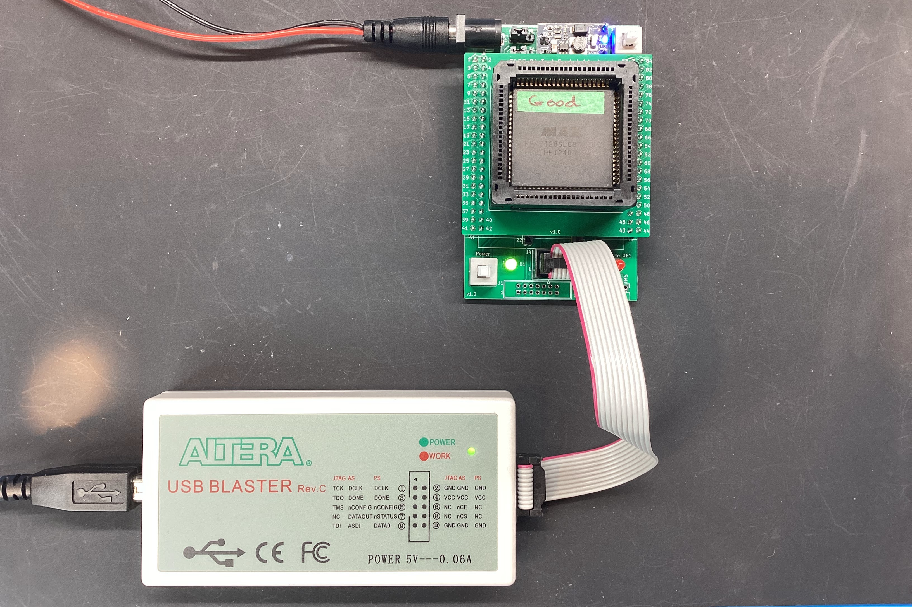
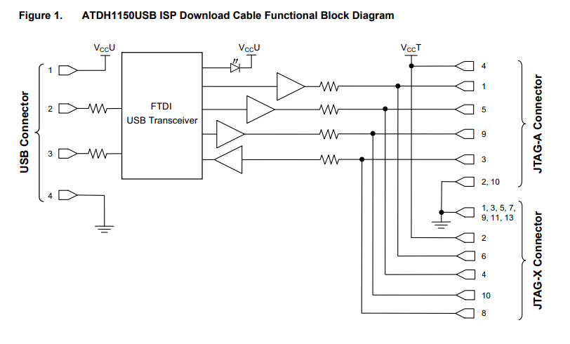
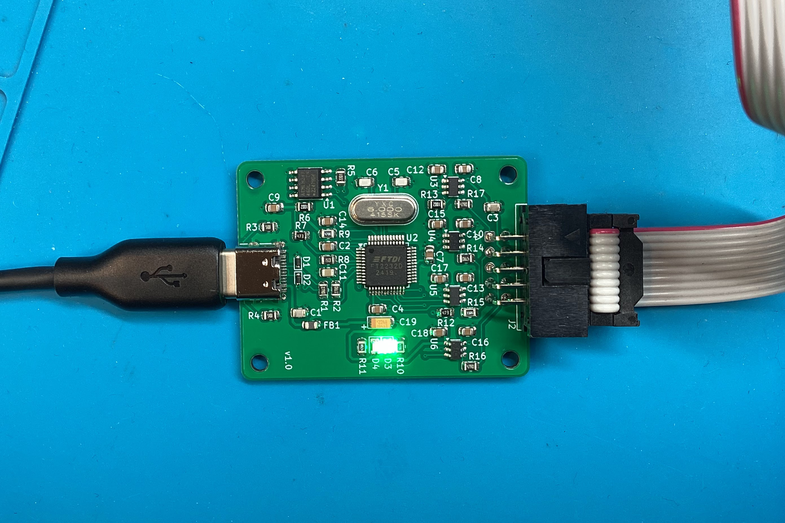
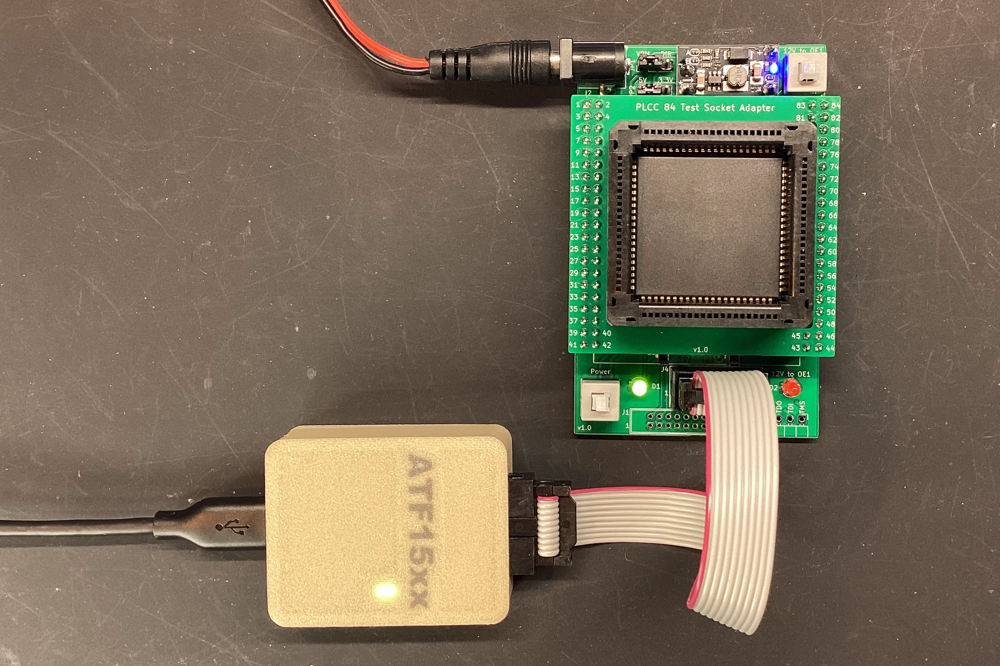
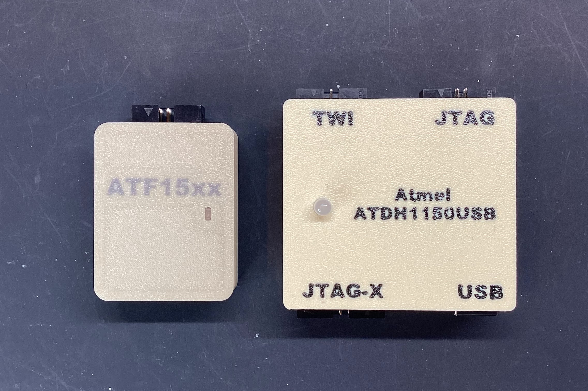

Recently I needed to program some Atmel ATF1504AS and ATF1508AS CPLD's as part of Peter Schranz's [RVL12 emulator](https://www.5volts.ch/pages/rlv12v2/) project.  I had worked with similar Altera Max 7000 EPM7128SLC84 CPLD's that can be programmed with the readily available USB Blaster clones (~$20), but the only modern'ish programmer available for the Atmel's was Kana/Microchip's [ATDH1150USB](https://www.microchip.com/en-us/development-tool/atdh1150usb) which has risen to ~$100 over the last few years and seems to be getting harder to find in stock.  I tried various other FTDI based programmers and OpenOCD using the excellent writeup on https://www.hackup.net/2020/01/erasing-and-programming-the-atf1504-cpld/, but I couldn't get that setup to work reliably(3.3V source with 5V target?) so I ended up buying an uncased ATDH1150USB off eBay (unfortunately shipping from England to the US was more than the programmer itself), which worked great but got me motivated to do some additional work in this area.

# [ATDH1150USB 3D Printed Case](Atmel-ATDH1150USB-Case)

First I needed a case.  Simple two piece model that screws together with two M3x10mm taper head screws.

# [Atmel-ATF15XX-Programming-Adapter](Atmel-ATF15XX-Programming-Adapter)

Next I wanted to create a programming adapter than takes either a PLCC44 or PLCC84 adapter board to allow for easy used chip testing and programming. I had bought some cheap ATF1508AS's from AliExpress and a couple of them were JTAG locked so I needed a way to apply 12V to the OE1 pin to restore JTAG functionality. I had designed a similar board for [Xilinx XC9500](https://github.com/djtersteegc/xilinx-xc9500xl-programming-adapter) CPLD's, so this was a variation on that theme.

[Atmel-ATF15XX-Programming-Adapter Schematic](https://djtersteegc.github.io/Atmel-ATF15XX-Programming-Hardware/Atmel-ATF15XX-Programming-Adapter-Schematic-v1.0.pdf)

[Atmel-ATF15XX-Programming-Adapter BOM](https://djtersteegc.github.io/Atmel-ATF15XX-Programming-Hardware/Atmel-ATF15XX-Programming-Adapter-ibom-v1.0.html)

JP1 selected whetherthe ATF15xx will be powered by the (optional) onboard VRM's or directly from the supply into the DC barrel jack.

JP2 selects whether you'll see 5V or 3.3V volts at the ATF15xx.  When using the VRM's, make sure the supply voltage is a couple of volts higher, but less than the 12V being output by the boost convertor.

The bottom left locking push button controls board power, and the top right controls if +12V is routed to OE1 on the ATF15xx. When needing to executethis to reenable JTAG, make sure to apply VCC first, then 12V (top right button), program the chip, power off 12V, and then power off VCC. You may initially get a verify error on this program attempt, but once you repower the chip and try again, everything should work normally.

I designed three adapter PCB's for both normal PLCC sockets and a PLCC84 test socket.  

[PLCC-44-Socket-Adapter](PLCC-44-Socket-Adapter)	[Schematic](https://djtersteegc.github.io/Atmel-ATF15XX-Programming-Hardware/PLCC-44-Socket-Adapter-Schematic-v1.0.pdf)	[BOM](https://djtersteegc.github.io/Atmel-ATF15XX-Programming-Hardware/PLCC-44-Socket-Adapter-ibom-v1.0.html)

[PLCC-84-Socket-Adapter](PLCC-84-Socket-Adapter)	[Schematic](https://djtersteegc.github.io/Atmel-ATF15XX-Programming-Hardware/PLCC-84-Socket-Adapter-Schematic-v1.0.pdf)	[BOM](https://djtersteegc.github.io/Atmel-ATF15XX-Programming-Hardware/PLCC-84-Socket-Adapter-ibom-v1.0.html)

[PLCC-84-Test-Socket-Adapter](PLCC-84-Test-Socket-Adapter)	[Schematic](https://djtersteegc.github.io/Atmel-ATF15XX-Programming-Hardware/PLCC-84-Test-Socket-Adapter-Schematic-v1.0.pdf)	[BOM](https://djtersteegc.github.io/Atmel-ATF15XX-Programming-Hardware/PLCC-84-Test-Socket-Adapter-ibom-v1.0.html)

The PLCC84 test socket I used was this (genuine?) Yamaichi IC120-0844-303 socket without PCB that I purchased from [AliExpress](https://www.aliexpress.us/item/3256806424159192.html).  Make sure you get this model since there are other Yamaichi IC120-0844-XXX models with the "less compatible" pin pattern that won't fit.

I didn't design a PLC44 test socket to DIP44 board since these are readily available with a test socket preinstalled on [AliExpress](https://www.aliexpress.us/item/3256807303077235.html) for <$15.

Also works great for programming Max 7000's devices that share a similar pinout.

# ATMISP Compatible Programmer

I spent a bit of time reading through this [thread](https://www.forum64.de/index.php?thread/94552-atf1504as-cpld-f%C3%BCr-fe3-%C3%BCber-jtag-programmieren/) on Forum64 , and the efforts there to get various generic FTDI boards recognized by Atmel's [ATMISP](https://www.microchip.com/en-us/development-tool/atmisp) programming software.  At it's core the ATDH1150USB is an FTDI2232D with a config EEPROM to identify itself to ATMISP, level converters on the JTAG lines to support 5V and 3.3V ATF15xx chips, and some status LED's.  Here's the block diagram from the manual.

Several hours of reverse engineering and I was able to create a functional equivalent.  Went with a USB-C port since it's 2025 and dropped the JTAG-X connector to keep the board size down.

Worked great with ATMISP v7.3 on Windows 10.  Similar to the ATDH1150USB the green LED will light when connected to ATMISP, both green and red LED's when successfully executing an operation, and the reb LED only when an error occurs.

Size comparison with his older brother.

I'm not going to publish the design files on this one just yet until I get rid of my initial batch of PCB's and parts, so if you are in the US and interested in an assembled and tested programmer as pictured above for half the cost of the official ATDH1150USB, drop me a line.  Should also have them up on [Tindie](https://www.tindie.com/stores/tersteeg/) in a bit.

Shield: [![CC BY-NC-SA 4.0][cc-by-nc-sa-shield]][cc-by-nc-sa]

This work is licensed under a
[Creative Commons Attribution-NonCommercial-ShareAlike 4.0 International License][cc-by-nc-sa].

[![CC BY-NC-SA 4.0][cc-by-nc-sa-image]][cc-by-nc-sa]

[cc-by-nc-sa]: http://creativecommons.org/licenses/by-nc-sa/4.0/
[cc-by-nc-sa-image]: https://licensebuttons.net/l/by-nc-sa/4.0/88x31.png
[cc-by-nc-sa-shield]: https://img.shields.io/badge/License-CC%20BY--NC--SA%204.0-lightgrey.svg

